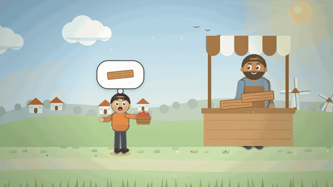
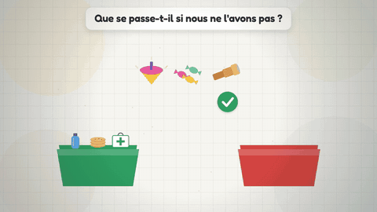
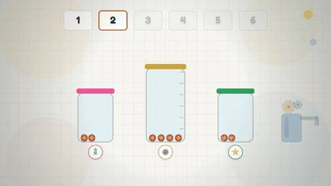
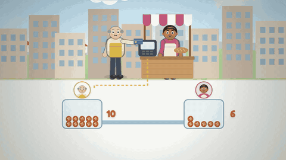
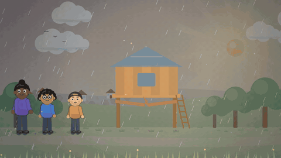

# Le Village des Trois Moulins

**L'argent expliqué aux 6-9 ans**, en 7 épisodes animés de 4 à 5 minutes. Sacha (7 ans, impulsif), Milo (8 ans, prévoyant) et Naya (12 ans, qui pose les bonnes questions) découvrent le troc, le travail, les besoins et les envies, le choix, l'épargne, la carte bancaire et le budget.

Tout est fait en code : les décors, les personnages et les animations sont dessinés en JavaScript (canvas), les voix sont synthétisées, et la vidéo est exportée image par image.


## Les épisodes

<!-- episodes:debut -->
| | Épisode | Ce qu'on apprend | Durée |
| :---: | :--- | :--- | :---: |
|  | **1 · L'Énigme des Pommes et des Briques**<br>[voir l'épisode](episodes/ep01/index.html) · [fiche YouTube](youtube/fiches/ep01.md) | Comprendre ce qu'est le troc et pourquoi il bloque vite | 4:09 |
|  | **2 · D'où Viennent les Pièces ?**<br>[voir l'épisode](episodes/ep02/index.html) · [fiche YouTube](youtube/fiches/ep02.md) | Relier l'argent au travail, au temps et à l'effort | 4:17 |
|  | **3 · La Boîte Rouge et la Boîte Verte**<br>[voir l'épisode](episodes/ep03/index.html) · [fiche YouTube](youtube/fiches/ep03.md) | Distinguer un besoin d'une envie | 4:11 |
|  | **4 · L'Aventure du Choix Invisible**<br>[voir l'épisode](episodes/ep04/index.html) · [fiche YouTube](youtube/fiches/ep04.md) | Comprendre que l'argent est limité | 3:52 |
|  | **5 · Le Pouvoir de la Patience**<br>[voir l'épisode](episodes/ep05/index.html) · [fiche YouTube](youtube/fiches/ep05.md) | Découvrir l'épargne pour un projet | 5:02 |
|  | **6 · La Carte Magique n'est pas Magique !**<br>[voir l'épisode](episodes/ep06/index.html) · [fiche YouTube](youtube/fiches/ep06.md) | Comprendre que payer par carte, c'est dépenser de l'argent réel | 4:10 |
|  | **7 · Le Grand Chantier de la Cabane**<br>[voir l'épisode](episodes/ep07/index.html) · [fiche YouTube](youtube/fiches/ep07.md) | Construire un budget simple : ressources, obligatoire, plaisir | 5:22 |
<!-- episodes:fin -->

Chaque épisode se termine par une question de Naya, à explorer à la maison ou en classe.

- [Bible pédagogique et scénarisation](bible-pedagogique.md) : fondements, cadre déontologique, ergonomie multimédia, personnages, curriculum, fiches des 7 épisodes et sources.
- [Lancer la chaîne YouTube](youtube/README.md) : identité, calendrier de publication, réglages, et une [fiche prête à copier](youtube/fiches/) pour chaque épisode (titre, description avec chapitres, tags, miniature, sous-titres).

## Organisation du dépôt

| Chemin | Contenu |
| :--- | :--- |
| `episodes/moteur.js` | Décors, personnages, objets, caméra, lecteur et chronologie, communs à toute la série |
| `episodes/epNN/` | Un épisode : scènes (`episode.js`), page de lecture (`index.html`), script (`voix-off.md`), voix (`audio/`) |
| `youtube/` | Miniatures, bannière, logo, sous-titres et fiches de publication |
| `docs/` | Images du README (extraits animés, planche des miniatures) |
| `tools/` | Voix, export vidéo, préparation YouTube |

Pour regarder un épisode, ouvrir `episodes/epNN/index.html` dans un navigateur : le lecteur joue l'animation avec la voix.

## Installation (en local)

```sh
npm install                        # Playwright
npx playwright install chromium
brew install ffmpeg                # ou tout autre ffmpeg dans le PATH
python3 -m venv .venv && .venv/bin/pip install edge-tts
```

## Fabriquer un épisode

1. **Voix** (voix neurales françaises de Microsoft Edge, gratuites, sans clé ni carte graphique) :

   ```sh
   .venv/bin/python tools/voix_edge.py episodes/ep02         # un épisode
   .venv/bin/python tools/voix_edge.py episodes/ep0*         # toute la série
   ```

   Un fichier `audio/NN-personnage.wav` par réplique, `manifest.json`, et `audio/durees.js` qui cale l'animation sur la durée réelle de la voix. Seules les répliques modifiées sont régénérées. La voix de chaque personnage se règle dans `ROLES`, en haut du script ; `--essais` fait dire à chaque personnage sa première réplique pour comparer.

   | Personnage | Voix |
   | :--- | :--- |
   | Narratrice | Denise |
   | Sacha | Éloïse (voix d'enfant) |
   | Milo | Éloïse, plus grave et plus posée |
   | Naya | Vivienne, rajeunie |
   | Adultes du village | Henri, Rémy, Gérard, Charline, Ariane, Sylvie |

2. **Vidéo** :

   ```sh
   node tools/render.cjs episodes/ep02 --no-subs   # out/ep02.mp4, voix mixée
   node tools/render.cjs episodes/ep02             # out/ep02-sous-titres.mp4
   ```

   `--muet` exporte sans la piste audio, `--script-only` régénère seulement `voix-off.md`, `FFMPEG=/chemin/vers/ffmpeg` choisit le binaire ffmpeg.

3. **YouTube** (après l'export des vidéos) :

   ```sh
   node tools/youtube.cjs              # miniatures, bannière, logo, sous-titres, chapitres, fiches
   node tools/youtube.cjs --apercus    # + extraits animés du README et bande-annonce (out/bande-annonce.mp4)
   ```

   Les titres, descriptions et tags se modifient dans [`youtube/episodes.json`](youtube/episodes.json), les visuels dans [`youtube/visuels.html`](youtube/visuels.html).

**Autres voix possibles** : `tools/voix_voxcpm.py` (VoxCPM2, open source, en local avec un GPU ou un Mac de 16 Go de mémoire) ou `tools/voix.mjs` (ElevenLabs, payant). Pour une chaîne monétisée, voir la section « Voix et droits » du [guide YouTube](youtube/README.md#5-voix-et-droits).

## Autres commandes

- `python tools/page.py "episodes/ep08=Titre"` : crée la page d'un nouvel épisode.
- `python tools/assemble.py` : regroupe les 7 épisodes dans une seule page autonome (`out/site/serie.html`).
- Dans un conteneur cloud derrière un proxy : `NODE_PATH=$(npm root -g) NODE_USE_ENV_PROXY=1 node tools/render.cjs ...`.
