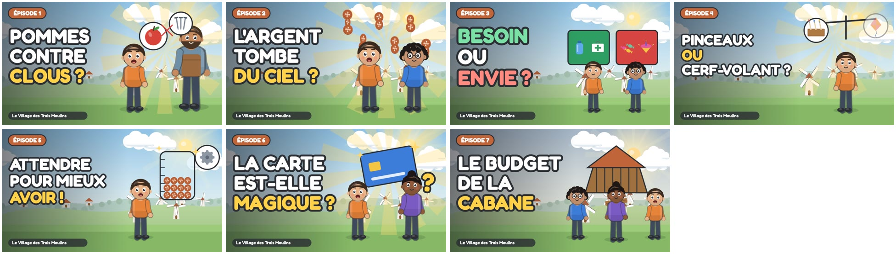

# Lancer la chaîne YouTube

Tout ce qu'il faut pour publier *Le Village des Trois Moulins* : identité de la chaîne, calendrier, réglages et une fiche prête à copier pour chaque épisode.

| Dossier | Contenu |
| :--- | :--- |
| [`chaine/`](chaine/) | Logo (800 × 800) et bannière (2560 × 1440) |
| [`miniatures/`](miniatures/) | Une miniature 1280 × 720 par épisode |
| [`fiches/`](fiches/) | Titre, description avec chapitres, tags et réglages de chaque épisode |
| [`sous-titres/`](sous-titres/) | Sous-titres français (.srt), calés sur la voix |
| `bande-annonce.mp4` | Bande-annonce de la chaîne (générée dans `out/`, non versionnée) |

Tout se régénère avec `node tools/youtube.cjs` (visuels, sous-titres, chapitres, fiches) et `node tools/youtube.cjs --apercus` (extraits animés du README et bande-annonce), après l'export des vidéos.



## 1. Identité de la chaîne

- **Nom** : Le Village des Trois Moulins
- **Identifiant** (à vérifier dans YouTube, par ordre de préférence) : `@VillageTroisMoulins`, `@LeVillageDesTroisMoulins`, `@TroisMoulins`
- **Logo** : [`chaine/logo.png`](chaine/logo.png) · **Bannière** : [`chaine/banniere.jpg`](chaine/banniere.jpg) (le texte tient dans la zone visible sur tous les écrans)

**Description de la chaîne** (à coller dans Personnalisation → Informations générales) :

```
Bienvenue au Village des Trois Moulins ! 🌾

Sacha (7 ans), Milo (8 ans) et Naya (12 ans) vivent dans un village d'artisans où l'on échange, on travaille, on choisit et on construit ensemble. À travers leurs aventures, les enfants de 6 à 9 ans découvrent l'argent : à quoi il sert, d'où il vient, comment bien le dépenser, l'épargner et faire un budget.

📺 7 épisodes de 4 à 5 minutes, un nouveau chaque mercredi.
🎯 Pour le cycle 2 (CP, CE1, CE2), à regarder en famille ou en classe.
💬 Chaque épisode se termine par une question à explorer à la maison.
🚫 Aucune marque, aucune banque, aucune publicité dans les épisodes.

Une série d'éducation financière douce, sans jugement : on apprend en se trompant, comme Sacha !
```

**Mots-clés de la chaîne** : `éducation financière, argent enfants, dessin animé éducatif, économie pour enfants, apprendre l'argent, cycle 2, épargne enfant, budget enfant`

## 2. Réglages à faire une fois

1. **Audience de la chaîne** : *Oui, définir cette chaîne comme conçue pour les enfants*. C'est obligatoire pour une série destinée aux 6-9 ans (loi américaine COPPA, appliquée par YouTube partout dans le monde). Conséquences : pas de commentaires, pas de fiches ni d'écrans de fin, pas de publicité personnalisée. En échange, les vidéos peuvent apparaître dans YouTube Kids.
2. **Pays** : France. **Langue des vidéos** : français.
3. **Importation par défaut** (Paramètres → Importation par défaut) : catégorie *Éducation*, licence YouTube standard, langue française, et les hashtags `#educationfinanciere #dessinanime #pourenfants` en fin de description.
4. **Playlist** « Le Village des Trois Moulins · L'argent expliqué aux enfants », avec cette description :

   ```
   Les 7 épisodes dans l'ordre : le troc et la naissance de la monnaie, le travail, besoins et envies, le choix invisible, l'épargne, la carte bancaire et le budget. Pour les 6-9 ans.
   ```

5. **Bande-annonce de la chaîne** (Personnalisation → Mise en page → Vidéo de bande-annonce pour les visiteurs non abonnés) : `out/bande-annonce.mp4`, publiée en *non répertoriée* ou en public.

## 3. Calendrier de publication

Un épisode par semaine, **le mercredi à 10 h** (le jour sans école en primaire). Programmer toutes les vidéos à l'avance dans YouTube Studio : elles sortiront toutes seules.

| Date | Publication |
| :--- | :--- |
| mercredi 7 octobre 2026 | Bande-annonce + [Épisode 1 · L'Énigme des Pommes et des Briques](fiches/ep01.md) |
| mercredi 14 octobre 2026 | [Épisode 2 · D'où Viennent les Pièces ?](fiches/ep02.md) |
| mercredi 21 octobre 2026 | [Épisode 3 · La Boîte Rouge et la Boîte Verte](fiches/ep03.md) (vacances de la Toussaint) |
| mercredi 28 octobre 2026 | [Épisode 4 · L'Aventure du Choix Invisible](fiches/ep04.md) |
| mercredi 4 novembre 2026 | [Épisode 5 · Le Pouvoir de la Patience](fiches/ep05.md) |
| mercredi 11 novembre 2026 | [Épisode 6 · La Carte Magique n'est pas Magique !](fiches/ep06.md) |
| mercredi 18 novembre 2026 | [Épisode 7 · Le Grand Chantier de la Cabane](fiches/ep07.md) |

La date de départ se change dans [`episodes.json`](episodes.json) (`lancement`), puis `node tools/youtube.cjs` met les fiches à jour.

## 4. Publier un épisode (YouTube Studio → Créer → Importer des vidéos)

1. Importer `out/epNN.mp4`.
2. **Détails** : copier le titre et la description de la fiche, importer la miniature, ajouter à la playlist, choisir *Oui, elle est conçue pour les enfants*.
3. **Plus d'options** : coller les tags, langue *Français*, catégorie *Éducation*, sous-titres : *Importer un fichier* → `youtube/sous-titres/epNN.srt` (avec minutage).
4. **Contenu modifié ou synthétique** : *Non*. La série est un dessin animé, et la description indique déjà que les voix sont des voix de synthèse.
5. **Visibilité** : *Programmer* à la date du calendrier.

Les chapitres apparaissent automatiquement grâce aux minutages de la description (le premier commence à 0:00).

## 5. Voix et droits

- Les voix sont générées avec les voix neurales françaises de Microsoft Edge (`tools/voix_edge.py`). Ce service gratuit n'a pas de conditions publiques pour un usage commercial. **Avant de monétiser la chaîne**, régénérer les voix avec Azure Speech (mêmes voix, niveau gratuit F0 jusqu'à 500 000 caractères par mois, usage commercial autorisé), ou avec VoxCPM2 (`tools/voix_voxcpm.py`, open source).
- Les images et les animations sont entièrement produites par le code du dépôt.
- Polices : Fredoka et Atkinson Hyperlegible (licence SIL Open Font).
