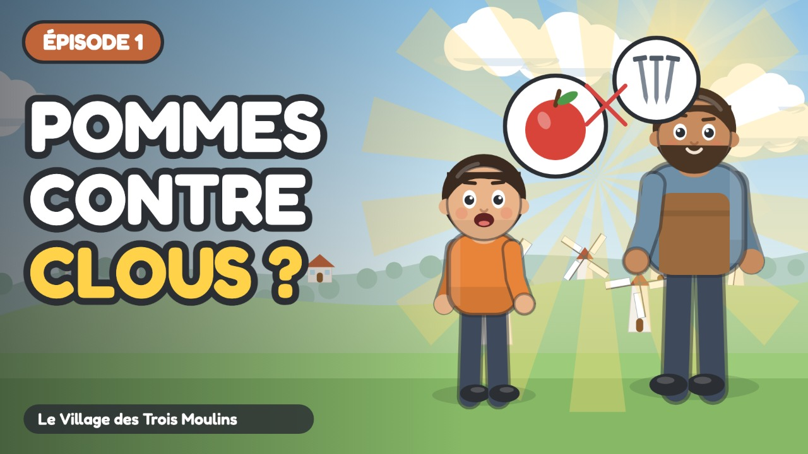

# Épisode 1 · L'Énigme des Pommes et des Briques



| Réglage | Valeur |
| :--- | :--- |
| Publication | mercredi 7 octobre 2026 à 10:00 (programmée) |
| Durée | 4:09 |
| Vidéo | `out/ep01.mp4` (`node tools/render.cjs episodes/ep01 --no-subs`) |
| Miniature | `youtube/miniatures/ep01.jpg` |
| Sous-titres | `youtube/sous-titres/ep01.srt` (français) |
| Public | **Oui, cette vidéo est conçue pour les enfants** |
| Catégorie | Éducation |
| Langue | Français |
| Playlist | Le Village des Trois Moulins |

## Titre

```
Pourquoi a-t-on inventé l'argent ? 🍎 Le troc expliqué aux enfants | Ép. 1
```

## Description

```
Sacha veut une planche de bois… mais le menuisier ne veut pas de ses pommes ! Comment faire quand personne ne veut ce que tu as ?

Au Village des Trois Moulins, Sacha essaie d'échanger ses pommes contre une planche. Mais le menuisier veut des clous, la forgeronne veut de la laine… et plus personne n'arrive à échanger ! Naya propose une idée toute simple : un petit jeton que tout le monde accepte. C'est la naissance de la monnaie.

🎯 Ce que l'enfant apprend :
• Comprendre ce qu'est le troc et pourquoi il bloque vite
• Découvrir la monnaie comme un objet que tout le monde accepte
• Voir que la monnaie permet de comparer le prix des choses

💬 La question de Naya, à faire à la maison :
À toi, maintenant ! Chez toi, cherche un objet que ta famille a acheté. S'il n'y avait pas de monnaie, qu'aurait-il fallu donner en échange ? Et à qui ?

👨‍👩‍👧 Pour les parents et les enseignants :
Série pour les 6-9 ans (cycle 2 : CP, CE1, CE2), épisode 1 sur 7. Regardez l'épisode ensemble, puis parlez de la question de Naya avec un exemple de la vie de tous les jours : c'est là que l'enfant retient le mieux. Aucune marque, aucune banque, aucune publicité dans la série.

⏱️ Chapitres :
0:00 Générique
0:07 Le village
0:36 Chez le menuisier
1:00 Chez la forgeronne
1:20 La chaîne bloquée
1:55 Naya et le troc
2:26 Les jetons d'argile
2:50 Tout circule
3:25 Ce qu'est la monnaie
3:47 À toi de chercher

➡️ Épisode suivant : D'où Viennent les Pièces ? (publié le mercredi suivant)

📺 Le Village des Trois Moulins : 7 petits épisodes pour comprendre l'argent, du troc au budget.
Animation dessinée en code (JavaScript), voix de synthèse. Texte et pédagogie : bible pédagogique de la série.

#educationfinanciere #dessinanime #pourenfants
```

## Tags

```
troc, histoire de la monnaie, pourquoi l'argent existe, à quoi sert l'argent, éducation financière enfants, argent expliqué aux enfants, dessin animé éducatif, apprendre l'argent, économie pour enfants, cycle 2, CP CE1 CE2, 6-9 ans, Le Village des Trois Moulins, Sacha Milo Naya
```
