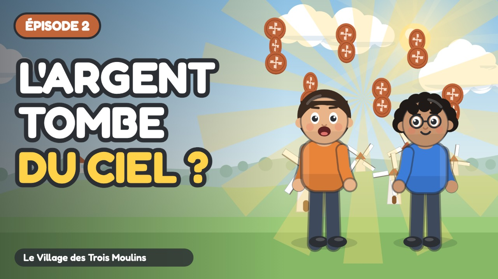

# Épisode 2 · D'où Viennent les Pièces ?



| Réglage | Valeur |
| :--- | :--- |
| Publication | mercredi 14 octobre 2026 à 10:00 (programmée) |
| Durée | 4:17 |
| Vidéo | `out/ep02.mp4` (`node tools/render.cjs episodes/ep02 --no-subs`) |
| Miniature | `youtube/miniatures/ep02.jpg` |
| Sous-titres | `youtube/sous-titres/ep02.srt` (français) |
| Public | **Oui, cette vidéo est conçue pour les enfants** |
| Catégorie | Éducation |
| Langue | Français |
| Playlist | Le Village des Trois Moulins |

## Titre

```
D'où vient l'argent ? 🪙 Le travail expliqué aux enfants | Ép. 2
```

## Description

```
Il suffit de tirer un levier pour avoir des jetons ? Sacha en est sûr… Milo, beaucoup moins !

Sacha découvre l'armoire du village : on tire un levier, et les jetons tombent ! Il croit qu'elle est magique. Avec Naya et Milo, il visite la maraîchère et le meunier, et comprend que chaque jeton vient d'abord d'un travail : du temps, de l'effort et un savoir-faire.

🎯 Ce que l'enfant apprend :
• Relier l'argent au travail, au temps et à l'effort
• Comprendre qu'un distributeur ne rend que ce qu'on y a déposé
• Reconnaître les services rendus par les gens autour de soi

💬 La question de Naya, à faire à la maison :
À toi, maintenant ! Autour de toi, qui travaille ? Quel service rend cette personne, ou qu'est-ce qu'elle fabrique ? Et toi, quel service pourrais-tu rendre à ta famille ou à tes amis ?

👨‍👩‍👧 Pour les parents et les enseignants :
Série pour les 6-9 ans (cycle 2 : CP, CE1, CE2), épisode 2 sur 7. Regardez l'épisode ensemble, puis parlez de la question de Naya avec un exemple de la vie de tous les jours : c'est là que l'enfant retient le mieux. Aucune marque, aucune banque, aucune publicité dans la série.

⏱️ Chapitres :
0:00 Générique
0:07 L'armoire du village
0:58 Au potager
1:52 Au moulin
2:31 Dans l'armoire
3:20 D'où viennent les pièces
3:54 À toi de chercher

➡️ Épisode suivant : La Boîte Rouge et la Boîte Verte (publié le mercredi suivant)

📺 Le Village des Trois Moulins : 7 petits épisodes pour comprendre l'argent, du troc au budget.
Animation dessinée en code (JavaScript), voix de synthèse. Texte et pédagogie : bible pédagogique de la série.

#educationfinanciere #dessinanime #pourenfants
```

## Tags

```
d'où vient l'argent, travail et argent, distributeur de billets enfant, métiers, éducation financière enfants, argent expliqué aux enfants, dessin animé éducatif, apprendre l'argent, économie pour enfants, cycle 2, CP CE1 CE2, 6-9 ans, Le Village des Trois Moulins, Sacha Milo Naya
```
