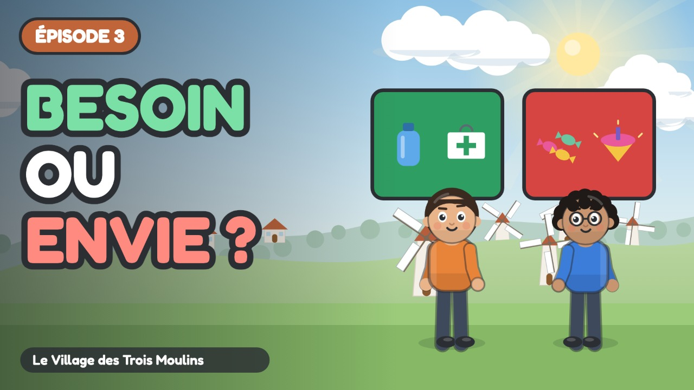

# Épisode 3 · La Boîte Rouge et la Boîte Verte



| Réglage | Valeur |
| :--- | :--- |
| Publication | mercredi 21 octobre 2026 à 10:00 (programmée) |
| Durée | 4:11 |
| Vidéo | `out/ep03.mp4` (`node tools/render.cjs episodes/ep03 --no-subs`) |
| Miniature | `youtube/miniatures/ep03.jpg` |
| Sous-titres | `youtube/sous-titres/ep03.srt` (français) |
| Public | **Oui, cette vidéo est conçue pour les enfants** |
| Catégorie | Éducation |
| Langue | Français |
| Playlist | Le Village des Trois Moulins |

## Titre

```
Besoin ou envie ? 🟢🔴 Apprendre à bien dépenser | Ép. 3
```

## Description

```
Dix jetons pour préparer une randonnée en montagne… et Sacha veut tout dépenser en bonbons et en longue-vue !

Sacha et Milo doivent acheter de quoi partir en randonnée. Sacha est attiré par les friandises et les gadgets ; Milo pense à l'eau et à la trousse de secours. Naya leur apprend un tri tout simple : la boîte verte pour les besoins, la boîte rouge pour les envies. Et une fois le vital assuré, il reste même de quoi se faire plaisir !

🎯 Ce que l'enfant apprend :
• Distinguer un besoin d'une envie
• Se demander « que se passe-t-il si on ne l'a pas ? »
• Comprendre qu'on paie d'abord l'essentiel, sans culpabiliser le plaisir

💬 La question de Naya, à faire à la maison :
À toi, maintenant ! La prochaine fois que tu fais les courses avec ta famille, regarde dans le panier. Qu'est-ce qui irait dans la boîte verte ? Et qu'est-ce qui irait dans la boîte rouge ?

👨‍👩‍👧 Pour les parents et les enseignants :
Série pour les 6-9 ans (cycle 2 : CP, CE1, CE2), épisode 3 sur 7. Regardez l'épisode ensemble, puis parlez de la question de Naya avec un exemple de la vie de tous les jours : c'est là que l'enfant retient le mieux. Aucune marque, aucune banque, aucune publicité dans la série.

⏱️ Chapitres :
0:00 Générique
0:07 Préparer la randonnée
0:41 Au marché
1:32 Deux boîtes
2:41 L'ordre compte
3:29 À toi de trier

➡️ Épisode suivant : L'Aventure du Choix Invisible (publié le mercredi suivant)

📺 Le Village des Trois Moulins : 7 petits épisodes pour comprendre l'argent, du troc au budget.
Animation dessinée en code (JavaScript), voix de synthèse. Texte et pédagogie : bible pédagogique de la série.

#educationfinanciere #dessinanime #pourenfants
```

## Tags

```
besoin ou envie, apprendre à dépenser, faire les courses enfant, priorités, éducation financière enfants, argent expliqué aux enfants, dessin animé éducatif, apprendre l'argent, économie pour enfants, cycle 2, CP CE1 CE2, 6-9 ans, Le Village des Trois Moulins, Sacha Milo Naya
```
