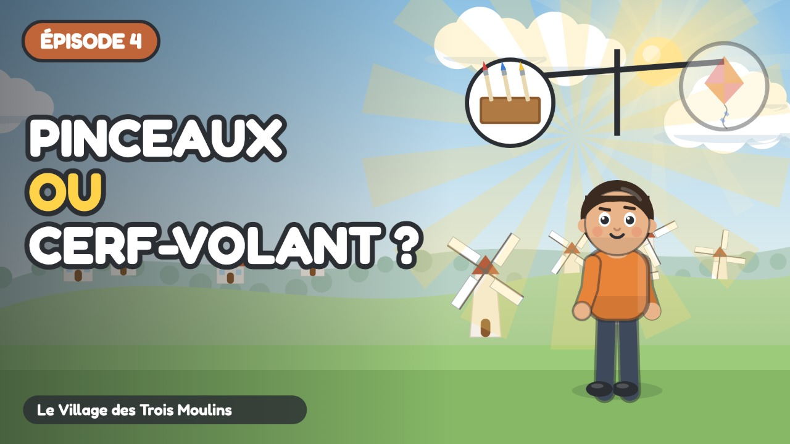

# Épisode 4 · L'Aventure du Choix Invisible



| Réglage | Valeur |
| :--- | :--- |
| Publication | mercredi 28 octobre 2026 à 10:00 (programmée) |
| Durée | 3:52 |
| Vidéo | `out/ep04.mp4` (`node tools/render.cjs episodes/ep04 --no-subs`) |
| Miniature | `youtube/miniatures/ep04.jpg` |
| Sous-titres | `youtube/sous-titres/ep04.srt` (français) |
| Public | **Oui, cette vidéo est conçue pour les enfants** |
| Catégorie | Éducation |
| Langue | Français |
| Playlist | Le Village des Trois Moulins |

## Titre

```
Choisir, c'est renoncer ! 🎨🪁 Le choix invisible expliqué aux enfants | Ép. 4
```

## Description

```
Cinq jetons, deux trésors au même prix : les pinceaux ou le cerf-volant ? Sacha voudrait les deux…

Sacha a gagné cinq jetons en travaillant au potager. Chez l'artisan nomade, il hésite entre une boîte de pinceaux et un cerf-volant, qui coûtent chacun cinq jetons. Avec une balance, Naya lui montre le « choix invisible » : acheter l'un, c'est renoncer à l'autre. Sacha prend le temps de choisir ce qui compte le plus pour lui.

🎯 Ce que l'enfant apprend :
• Comprendre que l'argent est limité
• Découvrir que chaque achat fait renoncer à autre chose
• Choisir sereinement selon ce qui compte le plus pour soi

💬 La question de Naya, à faire à la maison :
Qu'as-tu laissé de côté ce jour-là ? C'était ton choix invisible. Il n'y a pas de bon ou de mauvais choix. Il y a ce qui compte le plus pour toi, ce jour-là.

👨‍👩‍👧 Pour les parents et les enseignants :
Série pour les 6-9 ans (cycle 2 : CP, CE1, CE2), épisode 4 sur 7. Regardez l'épisode ensemble, puis parlez de la question de Naya avec un exemple de la vie de tous les jours : c'est là que l'enfant retient le mieux. Aucune marque, aucune banque, aucune publicité dans la série.

⏱️ Chapitres :
0:00 Générique
0:07 Cinq jetons
0:52 L'étal de l'artisan
1:53 Le choix invisible
2:42 Sacha choisit
3:22 Ton choix invisible

➡️ Épisode suivant : Le Pouvoir de la Patience (publié le mercredi suivant)

📺 Le Village des Trois Moulins : 7 petits épisodes pour comprendre l'argent, du troc au budget.
Animation dessinée en code (JavaScript), voix de synthèse. Texte et pédagogie : bible pédagogique de la série.

#educationfinanciere #dessinanime #pourenfants
```

## Tags

```
coût d'opportunité, faire un choix, rareté, prendre une décision enfant, éducation financière enfants, argent expliqué aux enfants, dessin animé éducatif, apprendre l'argent, économie pour enfants, cycle 2, CP CE1 CE2, 6-9 ans, Le Village des Trois Moulins, Sacha Milo Naya
```
