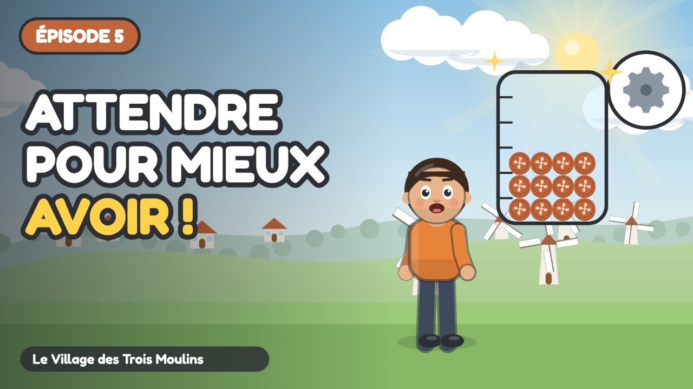

# Épisode 5 · Le Pouvoir de la Patience



| Réglage | Valeur |
| :--- | :--- |
| Publication | mercredi 4 novembre 2026 à 10:00 (programmée) |
| Durée | 5:02 |
| Vidéo | `out/ep05.mp4` (`node tools/render.cjs episodes/ep05 --no-subs`) |
| Miniature | `youtube/miniatures/ep05.jpg` |
| Sous-titres | `youtube/sous-titres/ep05.srt` (français) |
| Public | **Oui, cette vidéo est conçue pour les enfants** |
| Catégorie | Éducation |
| Langue | Français |
| Playlist | Le Village des Trois Moulins |

## Titre

```
Apprendre à épargner ⏳ La méthode des 3 bocaux | Ép. 5
```

## Description

```
Un kit à 12 jetons quand on en gagne 4 par semaine… impossible ? Pas avec les trois bocaux de Milo !

Sacha rêve d'un kit d'engrenages pour construire une pompe à eau, mais il coûte douze jetons. Plutôt que de tout dépenser en petites figurines, Milo lui montre la méthode des trois bocaux : un pour les petites envies, un pour le projet, un pour l'entraide. Semaine après semaine, le bocal se remplit… et la patience paie !

🎯 Ce que l'enfant apprend :
• Découvrir l'épargne pour un projet
• Utiliser la méthode des trois bocaux (dépenser, épargner, partager)
• Ressentir la fierté d'atteindre un objectif grâce à la patience

💬 La question de Naya, à faire à la maison :
Combien coûte-t-il ? Et combien de semaines faudrait-il pour y arriver, en mettant un peu de côté chaque semaine ? Tu peux dessiner ton propre bocal, avec des traits pour compter les semaines. Chaque trait te rapproche de ton projet.

👨‍👩‍👧 Pour les parents et les enseignants :
Série pour les 6-9 ans (cycle 2 : CP, CE1, CE2), épisode 5 sur 7. Regardez l'épisode ensemble, puis parlez de la question de Naya avec un exemple de la vie de tous les jours : c'est là que l'enfant retient le mieux. Aucune marque, aucune banque, aucune publicité dans la série.

⏱️ Chapitres :
0:00 Générique
0:07 À l'atelier de mécanique
0:55 Les trois bocaux
2:23 Semaine après semaine
3:46 La pompe du potager
4:32 Ton grand projet

➡️ Épisode suivant : La Carte Magique n'est pas Magique ! (publié le mercredi suivant)

📺 Le Village des Trois Moulins : 7 petits épisodes pour comprendre l'argent, du troc au budget.
Animation dessinée en code (JavaScript), voix de synthèse. Texte et pédagogie : bible pédagogique de la série.

#educationfinanciere #dessinanime #pourenfants
```

## Tags

```
épargne enfant, méthode des bocaux, tirelire, patience, argent de poche, éducation financière enfants, argent expliqué aux enfants, dessin animé éducatif, apprendre l'argent, économie pour enfants, cycle 2, CP CE1 CE2, 6-9 ans, Le Village des Trois Moulins, Sacha Milo Naya
```
