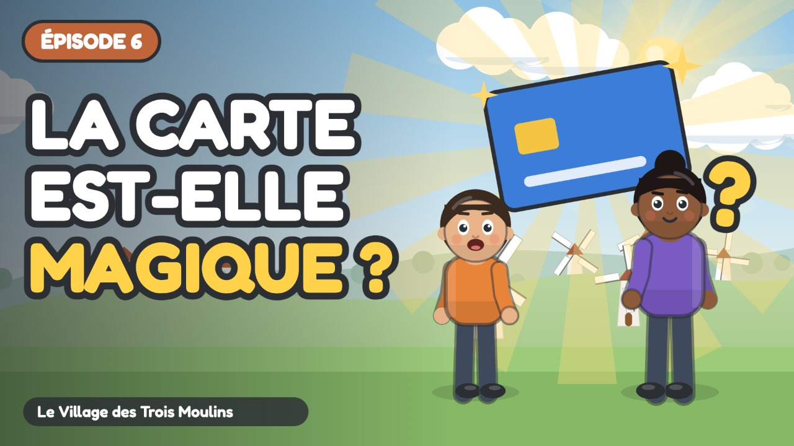

# Épisode 6 · La Carte Magique n'est pas Magique !



| Réglage | Valeur |
| :--- | :--- |
| Publication | mercredi 11 novembre 2026 à 10:00 (programmée) |
| Durée | 4:10 |
| Vidéo | `out/ep06.mp4` (`node tools/render.cjs episodes/ep06 --no-subs`) |
| Miniature | `youtube/miniatures/ep06.jpg` |
| Sous-titres | `youtube/sous-titres/ep06.srt` (français) |
| Public | **Oui, cette vidéo est conçue pour les enfants** |
| Catégorie | Éducation |
| Langue | Français |
| Playlist | Le Village des Trois Moulins |

## Titre

```
La carte bancaire, c'est magique ? 💳 L'argent invisible expliqué aux enfants | Ép. 6
```

## Description

```
Bip ! Une carte, et hop, on repart avec ses courses… Sacha croit avoir trouvé une carte magique !

En ville, Sacha voit des clients payer d'un simple « bip » avec une carte. Il pense qu'elle donne de l'argent à l'infini. Naya et Milo ouvrent le mécanisme : la carte est comme un tuyau relié au compte, qui s'est rempli grâce au travail. À chaque bip, l'argent passe d'un compte à l'autre… et quand le compte est vide, plus de bip !

🎯 Ce que l'enfant apprend :
• Comprendre que payer par carte, c'est dépenser de l'argent réel
• Voir le lien entre le compte, le travail et les achats
• Apprendre que l'argent invisible demande encore plus d'attention

💬 La question de Naya, à faire à la maison :
À toi, maintenant ! La prochaine fois qu'un adulte paie avec une carte, écoute bien le bip. Et demande-lui : d'où vient cet argent ? Et où s'en va-t-il ?

👨‍👩‍👧 Pour les parents et les enseignants :
Série pour les 6-9 ans (cycle 2 : CP, CE1, CE2), épisode 6 sur 7. Regardez l'épisode ensemble, puis parlez de la question de Naya avec un exemple de la vie de tous les jours : c'est là que l'enfant retient le mieux. Aucune marque, aucune banque, aucune publicité dans la série.

⏱️ Chapitres :
0:00 Générique
0:07 Au bourg
1:02 Ce que cache la borne
1:52 Le compte vide
2:32 Comment le compte se remplit
3:05 L'argent invisible
3:48 Écoute le bip

➡️ Épisode suivant : Le Grand Chantier de la Cabane (publié le mercredi suivant)

📺 Le Village des Trois Moulins : 7 petits épisodes pour comprendre l'argent, du troc au budget.
Animation dessinée en code (JavaScript), voix de synthèse. Texte et pédagogie : bible pédagogique de la série.

#educationfinanciere #dessinanime #pourenfants
```

## Tags

```
carte bancaire enfant, paiement sans contact, argent numérique, compte en banque expliqué, éducation financière enfants, argent expliqué aux enfants, dessin animé éducatif, apprendre l'argent, économie pour enfants, cycle 2, CP CE1 CE2, 6-9 ans, Le Village des Trois Moulins, Sacha Milo Naya
```
