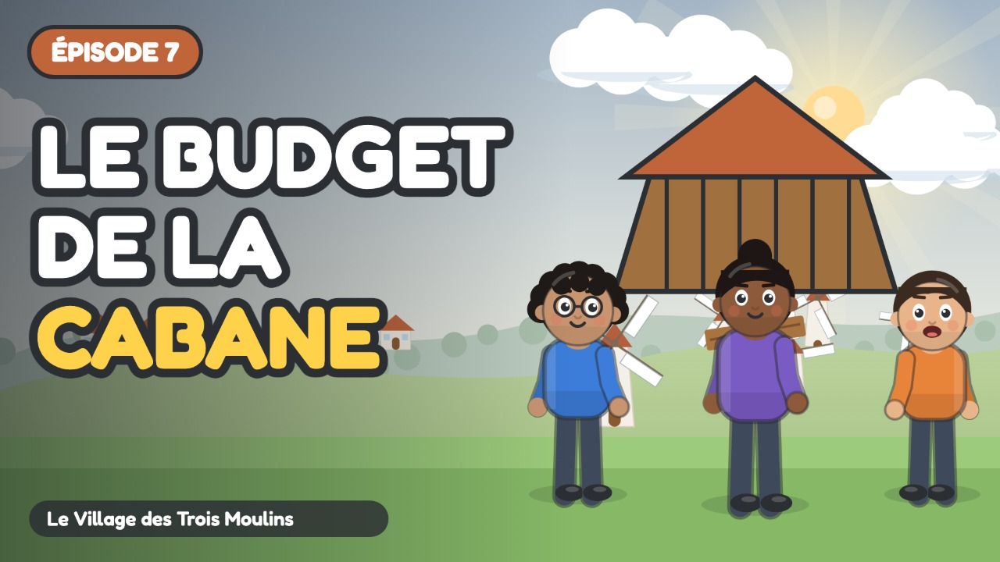

# Épisode 7 · Le Grand Chantier de la Cabane



| Réglage | Valeur |
| :--- | :--- |
| Publication | mercredi 18 novembre 2026 à 10:00 (programmée) |
| Durée | 5:22 |
| Vidéo | `out/ep07.mp4` (`node tools/render.cjs episodes/ep07 --no-subs`) |
| Miniature | `youtube/miniatures/ep07.jpg` |
| Sous-titres | `youtube/sous-titres/ep07.srt` (français) |
| Public | **Oui, cette vidéo est conçue pour les enfants** |
| Catégorie | Éducation |
| Langue | Français |
| Playlist | Le Village des Trois Moulins |

## Titre

```
Faire un budget 🏗️ Le grand chantier de la cabane | Ép. 7 (final)
```

## Description

```
Construire une cabane avec un budget serré… et soudain, une poutre se brise ! Le plan de Milo va-t-il tenir ?

Pour le grand final, Sacha, Milo et Naya construisent une cabane. Milo prépare un budget : ce qui est obligatoire, ce qui fait plaisir, et une petite réserve pour les imprévus. Quand une poutre casse sous le vent, la réserve sauve le chantier ! Un épisode qui réunit tout ce qu'on a appris dans la série.

🎯 Ce que l'enfant apprend :
• Construire un budget simple : ressources, obligatoire, plaisir
• Prévoir une réserve pour les imprévus
• Mener un projet à plusieurs, du plan jusqu'au bout

💬 La question de Naya, à faire à la maison :
À toi, maintenant ! Avec ta famille, choisis un petit projet : un pique-nique, une sortie, un cadeau. Fais la liste de ce qui est obligatoire, de ce qui fait plaisir… et n'oublie pas une petite réserve pour les imprévus !

👨‍👩‍👧 Pour les parents et les enseignants :
Série pour les 6-9 ans (cycle 2 : CP, CE1, CE2), épisode 7 sur 7. Regardez l'épisode ensemble, puis parlez de la question de Naya avec un exemple de la vie de tous les jours : c'est là que l'enfant retient le mieux. Aucune marque, aucune banque, aucune publicité dans la série.

⏱️ Chapitres :
0:00 Générique
0:07 Le projet de cabane
0:58 Le budget de Milo
2:18 Le chantier
3:06 La rafale
4:03 La cabane terminée
4:57 Ton projet en famille

🎉 C'est le dernier épisode de la série ! Retrouvez les 7 épisodes dans la playlist.

📺 Le Village des Trois Moulins : 7 petits épisodes pour comprendre l'argent, du troc au budget.
Animation dessinée en code (JavaScript), voix de synthèse. Texte et pédagogie : bible pédagogique de la série.

#educationfinanciere #dessinanime #pourenfants
```

## Tags

```
budget enfant, faire un budget, imprévus, projet en famille, gestion de l'argent, éducation financière enfants, argent expliqué aux enfants, dessin animé éducatif, apprendre l'argent, économie pour enfants, cycle 2, CP CE1 CE2, 6-9 ans, Le Village des Trois Moulins, Sacha Milo Naya
```
